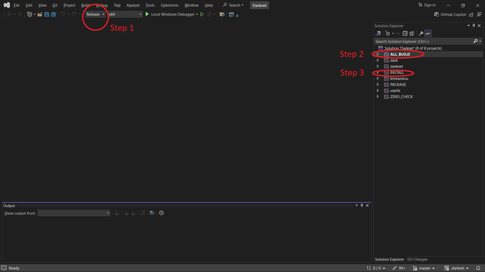

# Polish license plate detection and recognition

This project was created using Poetry. It can be
downloaded from [here](https://python-poetry.org/).

Poetry handles all of your dependencies and virtual environments.

## Running the project
The application can be run using the following command:
```bash
# Run the project
poetry run python -m license_plate_recognition.main <path_to_image>
```

The application will read an image from the specified path and display the license plate number present in the image.

## Project setup

The project requires Python 3.10 and Poetry to work.
To install all dependencies run the following commands:

```bash
# 1.  Install dependencies
poetry install
```

After installing the Python package, You need to extract [extras.zip](https://drive.google.com/file/d/1LHBDSbSFVhdKbvgZ_74m8OmUoxJ-Yow6/view?usp=sharing) file
to the root directory of the project.This contains the weights and dataset folder which is not
included in the code. you need to have directory structure like this:

```
license-plate-recognition/
|   poetry.lock
|   pyproject.toml
|   .gitignore
|   README.md
|___.dataset/   <-- HERE
|___.weights/  <-- HERE
|___character_segmentation/
|___license-plate-recognition/
|___plate_detection/
|___scripts/
```

Then you need to the clone the **Darknet** repository by running::

```bash
poetry run setup-darknet
```

After successfully cloning the repository, it must be built to enable bounding box detection.  
The build steps differ based on the operating system:

### 1. Windows

To build on Windows, you need to install the following software:

- [Cmake](https://cmake.org/download/)
- [Visual Studio](https://visualstudio.microsoft.com/)
  - while installing visual studio don't forget to select Desktop development with c++ workload.

> **Note**: While installing Visual Studio, ensure to select the **"Desktop development with C++"** workload.

After installing the required software, build **Darknet** using the following commands:

```shell
# generating the solution files
cmake -G {vs_version} -S .\.darknet\ -B .\.darknet\build\ -DENABLE_CUDA=OFF -DENABLE_CUDNN=OFF -DENABLE_OPENCV=OFF -ENABLE_OPENCV=OFF
```

> **Note**: `{vs_version}` refers to your installed Visual Studio version.

After running the `cmake` commands, a **solution file** will be generated. To create the executable file (`darknet.exe`), follow these steps using **Visual Studio**:

1. Open the solution file located at `.darknet/Darknet.sln` in Visual Studio.
2. Configure the build to **Release** mode.
3. Build the `ALL_BUILD` project.
4. Once `ALL_BUILD` is successfully completed, build the **INSTALL** project.

This will create the `darknet.exe` file in the `.darknet` folder.

The steps are also visually described in the image below.



Now you are ready to run the project.

---

### Troubleshooting: `pthreadVC2.dll not found` Error

If you encounter an error like:

```text
pthreadVC2.dll not found
```

you can resolve it with the following command:

```shell
cp .darknet\3rdparty\pthreads\bin\pthreadVC2.dll .darknet
```

### 2. Linux or Mac OS X

for linux and mac os, we just need to run the following in .darknet directory:

```bash
make
```

If you have GPU and want to make the prediction faster, you can change
the configuration from .darknet/Makefile.

## Virtual environment

Poetry automatically create Python virtual environment for you.
Run `poetry env info` to see details about the virtual environment.

## Dependencies

New dependencies can be added using `poetry add <package>`.
Read more about it [here](https://python-poetry.org/docs/basic-usage/#specifying-dependencies).
